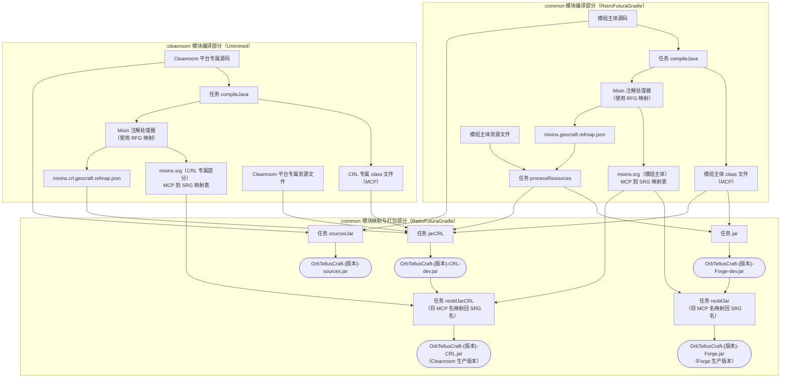

# 天圆地方 OrbTellusCraft

**切换语言**: **简体中文** | [English](https://github.com/QGMoe/GeoCraft/blob/master/README_EN.md)


[](https://www.mcmod.cn/class/22470.html)
[](https://www.curseforge.com/minecraft/mc-mods/qg-geocraft)
[](https://modrinth.com/project/3CKJAWbv)
[](https://github.com/QGMoe/GeoCraft)


[](https://github.com/QGMoe/GeoCraft/wiki)

天圆地方（OrbTellusCraft，简称 OTC）是一个致力于将地理要素融合进 Minecraft 的模组。 模组在保证尽可能不添加新方块、物品等要素的情况下，尽一切可能通过修改游戏机制，使 Minecraft 世界更加符合真实世界，将真正的地理带入 Minecraft。

从正在开发中的 0.3.0 版本开始，天圆地方的英文名将改名为 **OrbTellusCraft**，简称 **OTC**。原 GeoCraft 模组名称仅在 modid 保留。

该模组仍然处于早期开发中，功能尚不全面，且不保证能够稳定运行。如遇 bug，欢迎在上方提个 Issue，记得附上日志捏～

模组已实现的主要内容有：

- 流体物理系统
- 一个还不是很完善的大气系统，目前还未实现视觉效果、双端网络同步、区域天气系统等功能
- 土壤湿度系统
- 还有许多杂七杂八的特性，具体见下文

模组同时也拥有高度可自定义的配置文件，并提供了功能丰富的 API，允许第三方模组实现更多更好的功能。如果你有功能建议但尚未实现，欢迎提出 Issus！

## 流体物理 Fluid Physics

正如其名，流体物理系统让 Minecraft 中的流体更加真实。天圆地方的流体物理系统受模组 [Fluid Physics](https://github.com/lhns/mc-fluid-physics) 和 [Water Physics Overhaul](https://github.com/Sasai-Kudasai-BM/Water-Physics-Overhaul) 启发，包括对标前者的 VANILLA LIKE 模式，和对标后者的 MORE REALITY 模式。如果你不想要流体物理，也可以使用保留原版逻辑的 VANILLA 模式。模组默认使用 MORE REALITY 模式。

注意，在将要到来的 0.3.x 版本中，VANILLA LIKE 模式和 MORE REALITY 模式将更名为 CLASSIC 模式（经典模式）和 FINITE 模式（有限模式），VANILLA 模式（原版模式）不变。**文档后文将以新名称指代这两个模式。**

### 有限模式 FINITE

有限模式是天圆地方默认启用的流体物理模式，其完全改变了流体的流动方式以及视觉效果，原版流体源的概念被新的层（Quanta 或 Layer）概念完全取代，这种基于层的流体存在方式在本模组中也称为有限设计（Finite Design）。在有限模式下：

- 每块流体都是**真实**且**有限**的；
- 流体在水平面上会**向四周摊开**；
- 流体会向**低处**流动（负密度流体相反），包括垂直流动和坡度流动（默认禁用）；
- 被方块填充时，流体会尽可能填充进该方块，并在有剩余的情况下**向四周流动**而不会消失；
- 密度高的流体会沉到密度低的流体下方；
- **土壤系统联动**：
  - 水（或其它支持的流体）会自发下渗至**载流方块**（需要注意，这个概念不同于含水方块），或蒸发；
- **大气系统联动**，需在维度内启用大气系统以及对应特性：
  - 水在地表温度低于 0℃ 时会结冰（受原版方块限制，非满格水会结冰成对应高度的雪）； 
  - 雪、冰会在地表温度高于 0℃ 时融化；
  - 下雨时若**水汽充足**则会随机在地面上生成一片水。

有限模式基于的有限设计与原版采用的经典设计（用等级记录流体的流动状态，视觉体积不代表实际流体量的设计）在根本上不兼容，这意味着基于原版流体特性的红石机械、自动化农场都有很大可能失效，并带来新的学习成本。如果你体验过 [Water Physics Overhaul](https://github.com/Sasai-Kudasai-BM/Water-Physics-Overhaul) 以及其在 1.20+ 的继任者 Flowing Fluids，或许可以更好理解上文内容。


### 经典模式 CLASSIC

如果你期望使用流体物理，但难以接受有限模式带来的巨大变革，且期望能有更好的平均性能表现，则可以尝试经典模式。经典模式基于原版自有的经典设计（用等级记录流体的流动状态，视觉体积不代表实际流体量的设计）,并在此基础上做出了物理化改动，即让流体源能够以符合物理规律的方式移动。具体而言：

- 和原版一样，流体源的概念仍然存在；
- 流体源会在可能的情况下向**低处**流动（负密度流体相反），包括垂直流动和溯源流动；
- 在水平面上会保持原版的行为向四周摊开；
- 密度高的流体会移动到密度低的流体下方。

在性能上，经典模式在瞬时大规模流体流动目前逊色于多线程压强系统驱动的有限模式，但得益于其底层基于流体源移动的方式，系统整体可以以极快的速度收敛，从而不会像有限模式一样出现较长时间的卡顿。

### 压强系统 Pressure System

天圆地方为流体实现了一个高性能的**压强系统**，用以替代原版单线程的坡度流动算法。压强系统默认启用，并可以占用多个独立线程进行异步计算，因而能够大幅降低大量流体流动时的 MSPT 值 。但由于压强计算需要存储计算数据，因此内存占用在大规模流体流动时会偏高。若开启压强系统，建议 JVM 堆内存分配至少分配 4G，否则可能 GC （JVM 的内存清理机制）会频繁地进行内存垃圾回收。

目前为止，压强系统仅支持 FINITE 有限模式，未来会支持 CLASSIC 经典模式。

下图展示了一个由循环型命令方块创造的河流，在通过曲折的玻璃洞穴后，从左下方流出形成瀑布。其中压强系统在实现虹吸效应上起到了至关重要的作用。


## 大气系统 Atmosphere System

模组实现了一个基于游戏数据实时演算的**动态大气系统**，游戏内 ID 为 surface（主世界大气系统/表面大气系统，中文命名暂定）。该大气系统的运行独立于原版的生物群系，仅在初始化时使用生物群系的数据，其余时候会使用**实时的游戏数据**，这意味着玩家的活动会实实在在改变气候！

需要注意，该大气系统仍处于**早期开发**，对于特殊情况的模拟（例如空岛）存在较大失真，且有时会出现一些奇怪的情况。surface 大气系统的本质是一个极度简化的气候模型，即使短期内看起来没什么问题，仍然不适合长期游玩。除非你对气候模拟十分感兴趣并愿意进行测试，否则在长期使用该模组的情况下，建议通过配置文件切换到 vanilla 大气系统（即基于生物群系数据的静态大气系统）。

没错！除了 surface，大气系统还有多种实现方式（原版模式[基于生物群系]，封闭模式[密闭且恒温大气]），且支持第三方 Mod 添加更多大气系统。未来本模组也会添加更多预设的大气系统。你也可以将某个维度的大气系统设置为 none 以完全禁用大气系统，但请注意一个禁用大气系统的维度不等于一个没有大气的维度。

### 性质

- 大气加载独立于区块，未加载区块也会加载大气。你可以在配置文件中配置大气加载范围，注意这不一定适用于第三方 Mod 添加的大气系统；
- 本模组提供的大气系统每 60 游戏刻更新一次，称为大气刻。每游戏刻理想情况下只会更新六十分之一的大气，因此大气系统的运行在正常情况下对性能几乎没有影响；
- 你可以在存档文件夹下找到位于 DIMx/atmosphere 的大气区域文件，这是一种用于存储大气数据的二进制文件。如果你有换回原大气系统的需求的话，请记得在更换大气系统时备份里面的文件。

下面的内容均为 surface 表面大气系统的内容：

- 水汽会在大气间输送，只有有充足水汽时才会下雨；
- 水的相态变化会影响地面、大气的能量交换。例如，覆雪的地面不仅短波反射率会升高，雪融化也会吸收热量减缓升温；
- 地面热容和反射率会影响地面和大气的温度变化，进而产生局地热力环流（需要实验验证）；
- （待实现功能）区域天气系统。

## 土壤（湿度）系统 Soil (Moisture) System

天圆地方创造了“**分层流体承载方块（Layered Fluid Host Block）**”，简称“**载流方块**”的机制，在此之上构建出了土壤水文的模拟和一些其他机制。载流方块背后的 API 是一个关于流体存储和交换的接口，其定义了流体在方块中存储的结构和不同方块间交换流体的基本方式。在定义上，含水方块从集合角度讲是“载流方块”的子集（含水方块 ⊆ 载流方块）。例如：泥土、草方块、沙子都不是含水方块，但都可以透水。楼梯既是含水方块，又应该被认为是载流方块。

土壤系统会带来更新鲜的游戏玩法。例如，由于土壤可透水，在较湿润群系建设地下室成为了一项较麻烦的任务，因为你必须阻止潜在的漏水可能（需要 MORE REALITY）。但反过来，具有适宜湿度的沙子将不再容易落下，而是会形成稳定的结构。

在不同水物理模式下，土壤（包括其他载流方块）的表现比较不同。但只有在 MORE REALITY 流体物理模式下，大多数土壤水文机制才会生效。

土壤（包括其他多数载流方块）的实现并不是通过添加新方块实现的，而是通过 Mixin 拓展了原有方块的方块状态，这意味着尽管本模组现在看起来没有添加任何新的方块，但你并不能随意卸载该模组，否则这意味着某些被修改方块的方块种类会变得异常。

土壤系统暂时不支持第三方模组添加的土壤，例如 [BOP] 超多生物群系 (Biomes O' Plenty) 中的草方块。目前已有长期的兼容计划。

## 其他杂七杂八的特性

- 为了让原版客户端也能连接添加了本模组的服务器，模组默认在服务端启用了网络通信修改功能。该功能会修改发往所有玩家的数据包信息，并将拓展的方块状态映射回原版客户端可读取的方块状态，以实现对原版客户端的兼容。但这意味着除了耕地之外，玩家将无法读取其他方块的含水量或其它信息，这会一定程度上提高游戏难度。同时，该机制可能会略微提高服务端发送网络包的性能开销；
- 雪的机制（包括雪块）有大量调整，尤其是在 FINITE 有限模式下；
- FINITE 有限模式下耕地润湿机制有大幅度调整，具体见 MC 百科的 MORE REALITY 游戏设定。

## 运行要求

该模组要求使用 [MixinBooter](https://github.com/CleanroomMC/MixinBooter) 作为前置以提供 Mixin 环境。模组可以仅安装在服务端，但在双端安装下可以提供最佳效果。对于 Cleanroom 加载器，无需安装 MixinBooter 前置。

自 v0.2.7 版本开始，天圆地方开始主动兼容 Cleanroom 加载器，并同时发布针对 Forge 和 Cleanroom 的生产版本。请注意，尽管由于 Cleanroom 强大的向后兼容能力，使得天圆地方的 Forge 版本现阶段可以在 Cleanroom 上运行，但模组不保证 Forge 版本能够稳定适配 Cleanroom。若要在 Cleanroom 加载器上使用天圆地方，请考虑使用 CRL 后缀（Cleanroom Loader 的缩写）的生产版本。

由于 1.12.2 原版光照系统和渲染管线的限制，若没有进行额外的优化，即使仅有上千流体方块同时更新，光照计算仍会导致 MSPT 值飙升。安装诸如 [Alfheim Lighting Engine](https://github.com/Red-Studio-Ragnarok/Alfheim) 等光照优化模组可以解决此问题，并极大提升大量流体更新时的性能。对客户端同理，安装相关渲染优化模组可以缓解大量流体更新时的 FPS 波动，例如高清修复。

若开启压强系统且启用多线程计算（这是默认配置），并关闭坡度流动算法，大多数情况下对 CPU 的单核性能要求可以降低，但对内存要求会显著提高，建议至少分配 4GB 的最大 JVM 堆内存。另外，压强系统满载时（例如上万流体方块同时更新）会对 CPU 的多核性能造成比较大的压力，因此请确保你的 CPU 拥有比较好的多核性能。如果你的 CPU 有比较多的核心，例如 16 核甚至 32 核，建议阅读性能相关资料以进行配置调优。

你也可以参考模组文档，并通过配置文件调参以调整性能。

## 兼容性

- 一般情况下，模组的流体物理同样支持其它 Mod 加入的流体，但若其它 Mod 的流体重写了流动实现，则其无法具有本模组提供的流体物理效果。好消息是，MORE REALITY 流体物理模式下实现了对沉浸工程中混凝土的支持；
- 模组的 MORE REALITY 流体物理实现重写了沉浸工程和工业时代2的泵抽取和流体放置逻辑，你可以在配置文件中对其进行调整；
-你可以在配置文件中禁用指定流体的物理效果；
- 若卸载本模组，则一些载流方块会因数据值超出原版方块状态范围而变成同方块但不同数据值的方块，例如泥土可能变成灰化土，沙子可能变成红沙。未来可能会有无损卸载机制（或模组）；
- 网络通信修改机制可能会和诸如反矿透插件之类类似原理的 Mod、插件冲突。为避免此问题，你可以在配置文件中禁用该功能。注意！禁用后，若不使用其它 Mod、插件修改网络通信，则原版客户端或其它没有装本模组的客户端会出现比上一条所述更加异常的情况，即所有拓展的方块状态都会无法正常渲染；
- 若压强系统因多线程实现而出现无法接受的崩溃问题，请尝试禁用多线程或禁用压强系统，并最好将相关崩溃报告发送给作者；
- 该模组目前不兼容[Fluidlogged API](https://github.com/jbredwards/Fluidlogged-API)。目前兼容工作正在推进中。
- 作者会优先在 MC 百科更新文档，因此若其他地方（除 Github 源码）有表述与 MC 百科冲突，请以 MC 百科上的内容为准。具体优先级为：Github 源码 = MC 百科 > 其他。英文文档则会在 Github 上进行更新，但可能会滞后于中文文档。

## Q & A

**问：该mod有移植到其它版本的计划吗？**

暂时没有。

**问：还可能加入什么内容？**

外力作用啊、可再生岩浆等，反正想到什么有趣的地理机制就加什么。目前的计划有：

- 流体混合机制（例如不同含沙量等级水的混合）；
- 基于本模组拓展的玩法；
  - 光伏发电； 
  - 水力发电； 
  - 体温、水分系统以及相关的模组联动；
- 水循环的地下部分（地下含水层 [不是真实地形，类似于沉浸工程的矿脉]）；
- 基本地质系统（断裂带）。

**问：会加入新方块、实体等内容吗？**

会。但若这些新内容无法被映射到原版就有的内容，则会以附属的形式出现，因为加入这些内容会要求客户端也必须安装此模组，这和本模组（目前）兼容原版的目标相冲突。

**问：可以加入整合包吗？**

完全可以！但请注意该模组仍处于早期开发阶段，加入时务必小心。

**问：更新频率怎样？**

由于时间问题，接下来很长一段时间不会对模组进行很大的功能更新。

**问：有加入含水方块吗？**

没有，含水方块会在未来通过兼容 Fluidlogged API 实现。载流方块 API 只是一个流体交互协议，并不负责具体的机制。

**问：Cleanroom 不是向后兼容吗，为什么需要专门做针对 Cleanroom 的版本？**

有三个因素： 
1. 尽管声称 99% 向后兼容性，但 Cleanroom 仍然会有不能兼容的地方，对于这种地方天圆地方需要专门写适配 Cleanroom 的代码；
2. 对于一些热点调用路径，高版本的 Java 或 Cleanroom 可能提供了性能更好的实现方式；
3. Cleanroom 环境也有许多新的 API。

但导致分包的关键因素在于 Forge，不然其实可以将所有逻辑打包成一个 jar，无需发布专门针对 Cleanroom 的版本：尽管 Cleanroom 向前兼容，但 Forge 不一定向后兼容。Java 8 环境下的 Forge 可能无法正确处理一个同时包含 Java 8 和 Java 25 版本字节码的 jar，从而导致模组加载不完整，进而引发崩溃。因此模组的发布版本分成了 Forge 版本和 CRL 版本，后者在 Forge 的基础上额外包括针对 Cleanroom 平台的逻辑。

## 为本模组编写代码

### 贡献代码到模组本体

如果你不满足于本模组的某些部分，需要改进，欢迎在 Github 上通过 **Pull Request** 的方式为本模组贡献代码。

需要注意的是，目前本模组的开发工具链在未来还会变动。就目前为止，由于采用 Cleanroom 现代的 Forge 开发工具链，开发本模组需要 **Java 25 JDK** 环境。未来预计会有如下变动（按时间顺序）：

1. [x] Gradle 项目结构重构，分成多个子项目；
2. [x] 引入 Cleanroom 加载器直接支持；
3. 基于 JNI，用 Rust 编写高性能的底层实现，预计将用于流体物理和大气系统；
4. 进一步用 Github Workflow 自动化构建流程。

本模组同时使用 RetroFuturaGradle 和 Cleanroom 团队定制的 Unimined 工具链进行开发。一次 build 任务的构建流程如下（忽略前期的环境准备和单元测试）：



### 编写附属模组
（以下教程尚未得到实际工程验证）

本模组目前处于早期开发阶段，API 可能频繁变更，不推荐编写附属模组。如果仍要编写，推荐使用 Modrinth Maven 进行配置：

``` groovy
// ForgeGradle
// 依赖项格式 maven.modrinth:qg_geocraft:版本号(Version Number)
// 下面表示在编译时依赖天圆地方 v0.2.2 版本
compileOnly fg.deobf("maven.modrinth:qg_geocraft:0.2.2")

// RetroFuturaGradle 同理
compileOnly rfg.deobf("maven.modrinth:qg_geocraft:0.2.2")
// 若要依赖 CRL 版本，请在后面加上 -CRL 后缀，例如“maven.modrinth:qg_geocraft:0.2.7-CRL”
```

CurseForge Maven 虽然不推荐，但也可以使用：
``` groovy
// ForgeGradle
// 依赖项格式 curse.maven:qg-geocraft-1423755:文件ID，具体见 CurseForge
// 7599943 是 v0.2.2 版本文件在 CurseForge 上的 ID
compileOnly fg.deobf("curse.maven:qg-geocraft-1423755:7599943")

// RetroFuturaGradle 同理
compileOnly rfg.deobf("curse.maven:qg-geocraft-1423755:7599943")
```

## 你知道吗

- 天圆地方最初因 1.12.2 版本缺乏可用的流体物理模组而制作，在制作过程中受到了 Minecraft Java 1.15 及更高版本的 Fluid Physics 和 Water Physics Overhaul 两大知名流体物理模组的启发。尽管如此，整个天圆地方的流体物理系统是完全从零开始构建，在初期并未参考甚至使用过这两个模组的代码。如果不出意外，最终这个模组将不叫作天圆地方，而只是一个针对 1.12.2 的流体物理模组。但在开发中期，由于作者（QiguaiAAAA）是个地理爱好者，并不满足于流体物理这个单一系统，因此引入了大气系统，并在之后进一步引入土壤系统。这个模组由此成为了一个致力于在 Minecraft 中实现多个相互深度耦合的地理系统的模组。
- 如果你阅读过上述系统的实现，就会发现天圆地方的载流方块系统、大气系统、土壤系统（基于载流方块系统），以及未来可能添加的地下水系统、断裂带等，均非能在其他模组中找到完全类似实现的存在，即使其他模组中存在类似的概念。